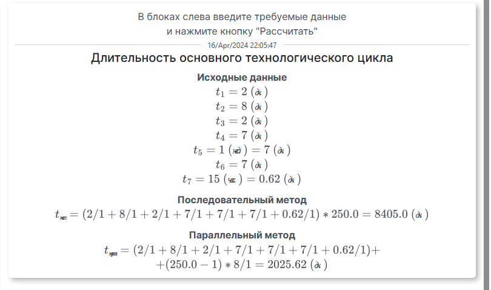

# logistic_calculator
Калькулятор времени выполнения логистических операций

## Особенности приложения:
### Адаптивный дизайн
<kbd></kbd>
<kbd></kbd>

### Светлая и темная темы
<kbd></kbd>

### Простой расчет технологических процессов по их времени
<kbd></kbd>

- Расчет параллельного и последовательного вида производственного процесса
- Настройка количества одновременно выполняемых параметров на одном этапе
- Вывод формул в LaTex-формате

### Сложный расчет технологических процессов по их времени
<kbd></kbd>

- Учет времени доставки товаров между пунктами и кол-ва одновременных потоков перевозок
- Настройка количества одновременно выполняемых параметров на одном этапе

### Расчет себестоимостей складов как элемента логистической цепочки
<kbd></kbd>

- Более 40 различных параметров, характеризующих расходы при обслуживании складских помещений
- Вывод формул в LaTex-формате

---

### Использованная литература:
- Богданова, Е. С. Концепция инфокоммуникационной сети как основа разработки интегрированных логистических систем предприятия в условиях цифровой экономики / Е. С. Богданова, Д. Г. Неволин, З. Б. Хмельницкая. – Екатеринбург : Уральский государственный университет путей сообщения, 2022. – 140 с. – ISBN 978-5-94614-504-6. – EDN BOMBRR.
